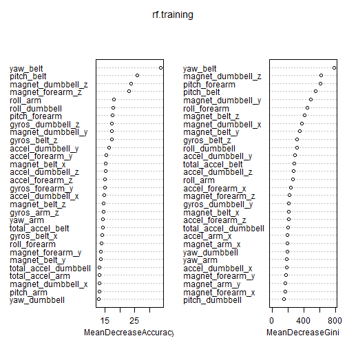

#Executive Summary
Using devices such as Jawbone Up, Nike FuelBand, and Fitbit it is now possible to collect a large amount of data about personal activity relatively inexpensively. These type of devices are part of the quantified self movement - a group of enthusiasts who take measurements about themselves regularly to improve their health, to find patterns in their behavior, or because they are tech geeks. 

One thing that people regularly do is quantify how much of a particular activity they do, but they rarely quantify how well they do it. In this project, we will use data from accelerometers on the belt, forearm, arm, and dumbell of 6 participants. They were asked to perform barbell lifts correctly and incorrectly in 5 different ways. More information is available from the website here: http://groupware.les.inf.puc-rio.br/har (see the section on the Weight Lifting Exercise Dataset). The goal of this analysis is to predict the manner in which they did the exercise. The dependent variable or response is the "classe" variable in the training set.

# Loading and preprocessing the data

The training data for this project are available here: 

https://d396qusza40orc.cloudfront.net/predmachlearn/pml-training.csv

The test data are available here: 

https://d396qusza40orc.cloudfront.net/predmachlearn/pml-testing.csv

The data for this project come from this source: http://groupware.les.inf.puc-rio.br/har.

We begin by loading the required libraries and reading in the training and testing datasets, assigning missing values to entries that are currently 'NA' or blank.


```r
#install.packages("corrplot")
#install.packages("e1071")
#install.packages("randomForest")

require(corrplot)
```

```
## Loading required package: corrplot
```

```
## Warning: package 'corrplot' was built under R version 3.1.2
```

```r
library(corrplot)
library(caret)
```

```
## Warning: package 'caret' was built under R version 3.1.2
```

```
## Loading required package: lattice
## Loading required package: ggplot2
```

```r
library(e1071)
```

```
## Warning: package 'e1071' was built under R version 3.1.2
```


```r
setwd("C:\\Users\\Katharine\\Documents\\GitHub\\MachineLearning_PeerAssessment1")

#download.file("https://d396qusza40orc.cloudfront.net/predmachlearn/pml-training.csv", destfile = "./pml-training.csv")
#download.file("https://d396qusza40orc.cloudfront.net/predmachlearn/pml-testing.csv", destfile = "./pml-testing.csv")

trainingOrg <- read.csv("pml-training.csv", header = TRUE, na.strings = c("NA", ""))
testingOrg <- read.csv("pml-testing.csv", header = TRUE, na.strings = c("NA", ""))
dim(trainingOrg)
```

```
## [1] 19622   160
```

```r
dim(testingOrg)
```

```
## [1]  20 160
```

To reduce the number of predictors:

- Remove variables that have too many missing values
- Remove irrelevant variables that are unlikely to be related to the dependent variable

Columns in the orignal training and testing datasets that are mostly filled with missing values are removed. To do this, count the number of missing values in each column of the full training dataset. We use those sums to create a logical variable for each column of the dataset. The logical variable's value is 'TRUE' if a column has no missing values (i.e. if the colSums = 0). If there are missing values in the column, the logical variable's value corresponding to that column will be 'FALSE'.

Applying the logical variable to the columns of the training and testing datasets will only keep those columns that are complete. (Note: This is a way of applying the 'complete.cases' function to the columns of a dataset.)

Our updated training dataset now has fewer variables to review in our analysis. Further, our final testing dataset has consistent columns in it (when compared with those in our slimmed-down training dataset). This will allow the fitted model (based on our training data) to be applied to the testing dataset.


```r
training.dena <- trainingOrg[ , colSums(is.na(trainingOrg)) == 0]
#head(training1)
#training3 <- training.decor[ rowSums(is.na(training.decor)) == 0, ]
dim(training.dena)
```

```
## [1] 19622    60
```

Create another logical vector to delete additional unnecessary columns from the pared-down training and testing datasets. Since these are the columns we want to remove, we apply the negation of the logical vector against the columns of our dataset.


```r
remove = c('X', 'user_name', 'raw_timestamp_part_1', 'raw_timestamp_part_2', 'cvtd_timestamp', 'new_window', 'num_window')
training.dere <- training.dena[, -which(names(training.dena) %in% remove)]
dim(training.dere)
```

```
## [1] 19622    53
```


Check for numeric variables that have extremely low variance (this method is useful nearZeroVar()


```r
zeroVar= nearZeroVar(training.dere[sapply(training.dere, is.numeric)], saveMetrics = TRUE)
training.nonzerovar = training.dere[,zeroVar[, 'nzv']==0]
dim(training.nonzerovar)
```

```
## [1] 19622    53
```

Remove highly correlated numeric variables 90%


```r
corrMatrix <- cor(na.omit(training.nonzerovar[sapply(training.nonzerovar, is.numeric)]))
dim(corrMatrix)
```

```
## [1] 52 52
```


```r
#Given that there are 52 variables
corrDF <- expand.grid(row = 1:52, col = 1:52)
corrDF$correlation <- as.vector(corrMatrix)
levelplot(correlation ~ row+ col, corrDF)
```

 


```r
removecor = findCorrelation(corrMatrix, cutoff = .90, verbose = TRUE)
```

```
## Considering row	 10 column	 1 value	 0.992 
##   Flagging column	 10 
## Considering row	 1 column	 9 value	 0.925 
##   Flagging column	 1 
## Considering row	 9 column	 22 value	 0.722 
## Considering row	 9 column	 4 value	 0.928 
##   Flagging column	 9 
## Considering row	 22 column	 4 value	 0.759 
## Considering row	 22 column	 3 value	 0.678 
## Considering row	 22 column	 36 value	 0.106 
## Considering row	 22 column	 8 value	 0.263 
## Considering row	 22 column	 2 value	 0.224 
## Considering row	 22 column	 11 value	 0.29 
## Considering row	 22 column	 29 value	 0.019 
## Considering row	 22 column	 37 value	 0.088 
## Considering row	 22 column	 35 value	 0.232 
## Considering row	 22 column	 38 value	 0.037 
## Considering row	 22 column	 30 value	 0.277 
## Considering row	 22 column	 47 value	 0.518 
## Considering row	 22 column	 21 value	 0.421 
## Considering row	 22 column	 5 value	 0.08 
## Considering row	 22 column	 34 value	 0.258 
## Considering row	 22 column	 6 value	 0.49 
## Considering row	 22 column	 20 value	 0.589 
## Considering row	 22 column	 39 value	 0.428 
## Considering row	 22 column	 44 value	 0.273 
## Considering row	 22 column	 14 value	 0.336 
## Considering row	 22 column	 41 value	 0.21 
## Considering row	 22 column	 52 value	 0.221 
## Considering row	 22 column	 23 value	 0.122 
## Considering row	 22 column	 28 value	 0.095 
## Considering row	 22 column	 7 value	 0.313 
## Considering row	 22 column	 25 value	 0.49 
## Considering row	 22 column	 12 value	 0.106 
## Considering row	 22 column	 49 value	 0.106 
## Considering row	 22 column	 42 value	 0.316 
## Considering row	 22 column	 13 value	 0.056 
## Considering row	 22 column	 27 value	 0.055 
## Considering row	 22 column	 48 value	 0.032 
## Considering row	 22 column	 24 value	 0.346 
## Considering row	 22 column	 16 value	 0.305 
## Considering row	 22 column	 26 value	 0.425 
## Considering row	 22 column	 40 value	 0.188 
## Considering row	 22 column	 17 value	 0.092 
## Considering row	 22 column	 50 value	 0.193 
## Considering row	 22 column	 15 value	 0.191 
## Considering row	 22 column	 19 value	 0.208 
## Considering row	 22 column	 51 value	 0.02 
## Considering row	 22 column	 43 value	 0.048 
## Considering row	 22 column	 32 value	 0.079 
## Considering row	 22 column	 46 value	 0.03 
## Considering row	 22 column	 45 value	 0.067 
## Considering row	 22 column	 31 value	 0.018 
## Considering row	 22 column	 33 value	 0.011 
## Considering row	 22 column	 18 value	 0.027 
## Considering row	 4 column	 3 value	 0.762 
## Considering row	 4 column	 36 value	 0.113 
## Considering row	 4 column	 8 value	 0.172 
## Considering row	 4 column	 2 value	 0.139 
## Considering row	 4 column	 11 value	 0.287 
## Considering row	 4 column	 29 value	 0.06 
## Considering row	 4 column	 37 value	 0.364 
## Considering row	 4 column	 35 value	 0.263 
## Considering row	 4 column	 38 value	 0.336 
## Considering row	 4 column	 30 value	 0.171 
## Considering row	 4 column	 47 value	 0.448 
## Considering row	 4 column	 21 value	 0.25 
## Considering row	 4 column	 5 value	 0.165 
## Considering row	 4 column	 34 value	 0.19 
## Considering row	 4 column	 6 value	 0.409 
## Considering row	 4 column	 20 value	 0.511 
## Considering row	 4 column	 39 value	 0.515 
## Considering row	 4 column	 44 value	 0.349 
## Considering row	 4 column	 14 value	 0.361 
## Considering row	 4 column	 41 value	 0.185 
## Considering row	 4 column	 52 value	 0.297 
## Considering row	 4 column	 23 value	 0.395 
## Considering row	 4 column	 28 value	 0.059 
## Considering row	 4 column	 7 value	 0.475 
## Considering row	 4 column	 25 value	 0.035 
## Considering row	 4 column	 12 value	 0.21 
## Considering row	 4 column	 49 value	 0.044 
## Considering row	 4 column	 42 value	 0.239 
## Considering row	 4 column	 13 value	 0.056 
## Considering row	 4 column	 27 value	 0.131 
## Considering row	 4 column	 48 value	 0.019 
## Considering row	 4 column	 24 value	 0.081 
## Considering row	 4 column	 16 value	 0.21 
## Considering row	 4 column	 26 value	 0.021 
## Considering row	 4 column	 40 value	 0.113 
## Considering row	 4 column	 17 value	 0.266 
## Considering row	 4 column	 50 value	 0.186 
## Considering row	 4 column	 15 value	 0.054 
## Considering row	 4 column	 19 value	 0.215 
## Considering row	 4 column	 51 value	 0.04 
## Considering row	 4 column	 43 value	 0.032 
## Considering row	 4 column	 32 value	 0.05 
## Considering row	 4 column	 46 value	 0.015 
## Considering row	 4 column	 45 value	 0.038 
## Considering row	 4 column	 31 value	 0.025 
## Considering row	 4 column	 33 value	 0.002 
## Considering row	 4 column	 18 value	 0.02 
## Considering row	 3 column	 36 value	 0.23 
## Considering row	 3 column	 8 value	 0.708 
## Considering row	 3 column	 2 value	 0.7 
## Considering row	 3 column	 11 value	 0.737 
## Considering row	 3 column	 29 value	 0.348 
## Considering row	 3 column	 37 value	 0.028 
## Considering row	 3 column	 35 value	 0.055 
## Considering row	 3 column	 38 value	 0.032 
## Considering row	 3 column	 30 value	 0.046 
## Considering row	 3 column	 47 value	 0.393 
## Considering row	 3 column	 21 value	 0.063 
## Considering row	 3 column	 5 value	 0.145 
## Considering row	 3 column	 34 value	 0.048 
## Considering row	 3 column	 6 value	 0.53 
## Considering row	 3 column	 20 value	 0.551 
## Considering row	 3 column	 39 value	 0.216 
## Considering row	 3 column	 44 value	 0.571 
## Considering row	 3 column	 14 value	 0.337 
## Considering row	 3 column	 41 value	 0.031 
## Considering row	 3 column	 52 value	 0.228 
## Considering row	 3 column	 23 value	 0.248 
## Considering row	 3 column	 28 value	 0.093 
## Considering row	 3 column	 7 value	 0.275 
## Considering row	 3 column	 25 value	 0.016 
## Considering row	 3 column	 12 value	 0.059 
## Considering row	 3 column	 49 value	 0.171 
## Considering row	 3 column	 42 value	 0.196 
## Considering row	 3 column	 13 value	 0.091 
## Considering row	 3 column	 27 value	 0.097 
## Considering row	 3 column	 48 value	 0.238 
## Considering row	 3 column	 24 value	 0.084 
## Considering row	 3 column	 16 value	 0.229 
## Considering row	 3 column	 26 value	 0.015 
## Considering row	 3 column	 40 value	 0.181 
## Considering row	 3 column	 17 value	 0.241 
## Considering row	 3 column	 50 value	 0.09 
## Considering row	 3 column	 15 value	 0.136 
## Considering row	 3 column	 19 value	 0.216 
## Considering row	 3 column	 51 value	 0.044 
## Considering row	 3 column	 43 value	 0.228 
## Considering row	 3 column	 32 value	 0.047 
## Considering row	 3 column	 46 value	 0.073 
## Considering row	 3 column	 45 value	 0.077 
## Considering row	 3 column	 31 value	 0.002 
## Considering row	 3 column	 33 value	 0.006 
## Considering row	 3 column	 18 value	 0.043 
## Considering row	 36 column	 8 value	 0.514 
## Considering row	 36 column	 2 value	 0.538 
## Considering row	 36 column	 11 value	 0.503 
## Considering row	 36 column	 29 value	 0.849 
## Considering row	 36 column	 37 value	 0.533 
## Considering row	 36 column	 35 value	 0.66 
## Considering row	 36 column	 38 value	 0.383 
## Considering row	 36 column	 30 value	 0.628 
## Considering row	 36 column	 47 value	 0.113 
## Considering row	 36 column	 21 value	 0.309 
## Considering row	 36 column	 5 value	 0.355 
## Considering row	 36 column	 34 value	 0.684 
## Considering row	 36 column	 6 value	 0.187 
## Considering row	 36 column	 20 value	 0.101 
## Considering row	 36 column	 39 value	 0.034 
## Considering row	 36 column	 44 value	 0.295 
## Considering row	 36 column	 14 value	 0.341 
## Considering row	 36 column	 41 value	 0.272 
## Considering row	 36 column	 52 value	 0.382 
## Considering row	 36 column	 23 value	 0.159 
## Considering row	 36 column	 28 value	 0.574 
## Considering row	 36 column	 7 value	 0.247 
## Considering row	 36 column	 25 value	 0.176 
## Considering row	 36 column	 12 value	 0.409 
## Considering row	 36 column	 49 value	 0.235 
## Considering row	 36 column	 42 value	 0.103 
## Considering row	 36 column	 13 value	 0.353 
## Considering row	 36 column	 27 value	 0.321 
## Considering row	 36 column	 48 value	 0.166 
## Considering row	 36 column	 24 value	 0.07 
## Considering row	 36 column	 16 value	 0.204 
## Considering row	 36 column	 26 value	 0.037 
## Considering row	 36 column	 40 value	 0.11 
## Considering row	 36 column	 17 value	 0.085 
## Considering row	 36 column	 50 value	 0.081 
## Considering row	 36 column	 15 value	 0.136 
## Considering row	 36 column	 19 value	 0.013 
## Considering row	 36 column	 51 value	 0.088 
## Considering row	 36 column	 43 value	 0.121 
## Considering row	 36 column	 32 value	 0.065 
## Considering row	 36 column	 46 value	 0 
## Considering row	 36 column	 45 value	 0.011 
## Considering row	 36 column	 31 value	 0.049 
## Considering row	 36 column	 33 value	 0.047 
## Considering row	 36 column	 18 value	 0.034 
## Considering row	 8 column	 2 value	 0.966 
##   Flagging column	 8 
## Considering row	 2 column	 11 value	 0.884 
## Considering row	 2 column	 29 value	 0.66 
## Considering row	 2 column	 37 value	 0.461 
## Considering row	 2 column	 35 value	 0.452 
## Considering row	 2 column	 38 value	 0.364 
## Considering row	 2 column	 30 value	 0.318 
## Considering row	 2 column	 47 value	 0.128 
## Considering row	 2 column	 21 value	 0.196 
## Considering row	 2 column	 5 value	 0.436 
## Considering row	 2 column	 34 value	 0.166 
## Considering row	 2 column	 6 value	 0.397 
## Considering row	 2 column	 20 value	 0.315 
## Considering row	 2 column	 39 value	 0.257 
## Considering row	 2 column	 44 value	 0.54 
## Considering row	 2 column	 14 value	 0.17 
## Considering row	 2 column	 41 value	 0.254 
## Considering row	 2 column	 52 value	 0.064 
## Considering row	 2 column	 23 value	 0.047 
## Considering row	 2 column	 28 value	 0.232 
## Considering row	 2 column	 7 value	 0.107 
## Considering row	 2 column	 25 value	 0.047 
## Considering row	 2 column	 12 value	 0.09 
## Considering row	 2 column	 49 value	 0.23 
## Considering row	 2 column	 42 value	 0.049 
## Considering row	 2 column	 13 value	 0.137 
## Considering row	 2 column	 27 value	 0.35 
## Considering row	 2 column	 48 value	 0.362 
## Considering row	 2 column	 24 value	 0.045 
## Considering row	 2 column	 16 value	 0.143 
## Considering row	 2 column	 26 value	 0.002 
## Considering row	 2 column	 40 value	 0.145 
## Considering row	 2 column	 17 value	 0.093 
## Considering row	 2 column	 50 value	 0.072 
## Considering row	 2 column	 15 value	 0.161 
## Considering row	 2 column	 19 value	 0.11 
## Considering row	 2 column	 51 value	 0.017 
## Considering row	 2 column	 43 value	 0.329 
## Considering row	 2 column	 32 value	 0.03 
## Considering row	 2 column	 46 value	 0.096 
## Considering row	 2 column	 45 value	 0.068 
## Considering row	 2 column	 31 value	 0.014 
## Considering row	 2 column	 33 value	 0.008 
## Considering row	 2 column	 18 value	 0.051 
## Considering row	 11 column	 29 value	 0.607 
## Considering row	 11 column	 37 value	 0.347 
## Considering row	 11 column	 35 value	 0.421 
## Considering row	 11 column	 38 value	 0.256 
## Considering row	 11 column	 30 value	 0.337 
## Considering row	 11 column	 47 value	 0.172 
## Considering row	 11 column	 21 value	 0.162 
## Considering row	 11 column	 5 value	 0.426 
## Considering row	 11 column	 34 value	 0.192 
## Considering row	 11 column	 6 value	 0.404 
## Considering row	 11 column	 20 value	 0.38 
## Considering row	 11 column	 39 value	 0.223 
## Considering row	 11 column	 44 value	 0.545 
## Considering row	 11 column	 14 value	 0.209 
## Considering row	 11 column	 41 value	 0.241 
## Considering row	 11 column	 52 value	 0.041 
## Considering row	 11 column	 23 value	 0.005 
## Considering row	 11 column	 28 value	 0.252 
## Considering row	 11 column	 7 value	 0.022 
## Considering row	 11 column	 25 value	 0.009 
## Considering row	 11 column	 12 value	 0.049 
## Considering row	 11 column	 49 value	 0.298 
## Considering row	 11 column	 42 value	 0.028 
## Considering row	 11 column	 13 value	 0.115 
## Considering row	 11 column	 27 value	 0.292 
## Considering row	 11 column	 48 value	 0.327 
## Considering row	 11 column	 24 value	 0.009 
## Considering row	 11 column	 16 value	 0.125 
## Considering row	 11 column	 26 value	 0.009 
## Considering row	 11 column	 40 value	 0.157 
## Considering row	 11 column	 17 value	 0.085 
## Considering row	 11 column	 50 value	 0.03 
## Considering row	 11 column	 15 value	 0.177 
## Considering row	 11 column	 19 value	 0.146 
## Considering row	 11 column	 51 value	 0.075 
## Considering row	 11 column	 43 value	 0.259 
## Considering row	 11 column	 32 value	 0.049 
## Considering row	 11 column	 46 value	 0.093 
## Considering row	 11 column	 45 value	 0.068 
## Considering row	 11 column	 31 value	 0.011 
## Considering row	 11 column	 33 value	 0.006 
## Considering row	 11 column	 18 value	 0.063 
## Considering row	 29 column	 37 value	 0.577 
## Considering row	 29 column	 35 value	 0.541 
## Considering row	 29 column	 38 value	 0.442 
## Considering row	 29 column	 30 value	 0.527 
## Considering row	 29 column	 47 value	 0.01 
## Considering row	 29 column	 21 value	 0.327 
## Considering row	 29 column	 5 value	 0.438 
## Considering row	 29 column	 34 value	 0.545 
## Considering row	 29 column	 6 value	 0.293 
## Considering row	 29 column	 20 value	 0.182 
## Considering row	 29 column	 39 value	 0.108 
## Considering row	 29 column	 44 value	 0.323 
## Considering row	 29 column	 14 value	 0.28 
## Considering row	 29 column	 41 value	 0.28 
## Considering row	 29 column	 52 value	 0.193 
## Considering row	 29 column	 23 value	 0.142 
## Considering row	 29 column	 28 value	 0.517 
## Considering row	 29 column	 7 value	 0.245 
## Considering row	 29 column	 25 value	 0.103 
## Considering row	 29 column	 12 value	 0.244 
## Considering row	 29 column	 49 value	 0.019 
## Considering row	 29 column	 42 value	 0.056 
## Considering row	 29 column	 13 value	 0.213 
## Considering row	 29 column	 27 value	 0.277 
## Considering row	 29 column	 48 value	 0.191 
## Considering row	 29 column	 24 value	 0.059 
## Considering row	 29 column	 16 value	 0.144 
## Considering row	 29 column	 26 value	 0.05 
## Considering row	 29 column	 40 value	 0.013 
## Considering row	 29 column	 17 value	 0.029 
## Considering row	 29 column	 50 value	 0.099 
## Considering row	 29 column	 15 value	 0.178 
## Considering row	 29 column	 19 value	 0.049 
## Considering row	 29 column	 51 value	 0.063 
## Considering row	 29 column	 43 value	 0.189 
## Considering row	 29 column	 32 value	 0.064 
## Considering row	 29 column	 46 value	 0.042 
## Considering row	 29 column	 45 value	 0.038 
## Considering row	 29 column	 31 value	 0.014 
## Considering row	 29 column	 33 value	 0.017 
## Considering row	 29 column	 18 value	 0.054 
## Considering row	 37 column	 35 value	 0.269 
## Considering row	 37 column	 38 value	 0.769 
## Considering row	 37 column	 30 value	 0.104 
## Considering row	 37 column	 47 value	 0.073 
## Considering row	 37 column	 21 value	 0.49 
## Considering row	 37 column	 5 value	 0.745 
## Considering row	 37 column	 34 value	 0.429 
## Considering row	 37 column	 6 value	 0.345 
## Considering row	 37 column	 20 value	 0.182 
## Considering row	 37 column	 39 value	 0.168 
## Considering row	 37 column	 44 value	 0.1 
## Considering row	 37 column	 14 value	 0.216 
## Considering row	 37 column	 41 value	 0.271 
## Considering row	 37 column	 52 value	 0.035 
## Considering row	 37 column	 23 value	 0.317 
## Considering row	 37 column	 28 value	 0.49 
## Considering row	 37 column	 7 value	 0.5 
## Considering row	 37 column	 25 value	 0.075 
## Considering row	 37 column	 12 value	 0.243 
## Considering row	 37 column	 49 value	 0.186 
## Considering row	 37 column	 42 value	 0.105 
## Considering row	 37 column	 13 value	 0.286 
## Considering row	 37 column	 27 value	 0.156 
## Considering row	 37 column	 48 value	 0.002 
## Considering row	 37 column	 24 value	 0.041 
## Considering row	 37 column	 16 value	 0.128 
## Considering row	 37 column	 26 value	 0.035 
## Considering row	 37 column	 40 value	 0.162 
## Considering row	 37 column	 17 value	 0.046 
## Considering row	 37 column	 50 value	 0.104 
## Considering row	 37 column	 15 value	 0 
## Considering row	 37 column	 19 value	 0.016 
## Considering row	 37 column	 51 value	 0.043 
## Considering row	 37 column	 43 value	 0.021 
## Considering row	 37 column	 32 value	 0.084 
## Considering row	 37 column	 46 value	 0.004 
## Considering row	 37 column	 45 value	 0.001 
## Considering row	 37 column	 31 value	 0.065 
## Considering row	 37 column	 33 value	 0.016 
## Considering row	 37 column	 18 value	 0.065 
## Considering row	 35 column	 38 value	 0.493 
## Considering row	 35 column	 30 value	 0.773 
## Considering row	 35 column	 47 value	 0.162 
## Considering row	 35 column	 21 value	 0.213 
## Considering row	 35 column	 5 value	 0.302 
## Considering row	 35 column	 34 value	 0.407 
## Considering row	 35 column	 6 value	 0.046 
## Considering row	 35 column	 20 value	 0.012 
## Considering row	 35 column	 39 value	 0.227 
## Considering row	 35 column	 44 value	 0.193 
## Considering row	 35 column	 14 value	 0.172 
## Considering row	 35 column	 41 value	 0.237 
## Considering row	 35 column	 52 value	 0.273 
## Considering row	 35 column	 23 value	 0.204 
## Considering row	 35 column	 28 value	 0.157 
## Considering row	 35 column	 7 value	 0.196 
## Considering row	 35 column	 25 value	 0.088 
## Considering row	 35 column	 12 value	 0.404 
## Considering row	 35 column	 49 value	 0.154 
## Considering row	 35 column	 42 value	 0.167 
## Considering row	 35 column	 13 value	 0.316 
## Considering row	 35 column	 27 value	 0.72 
## Considering row	 35 column	 48 value	 0.165 
## Considering row	 35 column	 24 value	 0.007 
## Considering row	 35 column	 16 value	 0.086 
## Considering row	 35 column	 26 value	 0.031 
## Considering row	 35 column	 40 value	 0.134 
## Considering row	 35 column	 17 value	 0.106 
## Considering row	 35 column	 50 value	 0.076 
## Considering row	 35 column	 15 value	 0.075 
## Considering row	 35 column	 19 value	 0.021 
## Considering row	 35 column	 51 value	 0.043 
## Considering row	 35 column	 43 value	 0.167 
## Considering row	 35 column	 32 value	 0.079 
## Considering row	 35 column	 46 value	 0.047 
## Considering row	 35 column	 45 value	 0.037 
## Considering row	 35 column	 31 value	 0.007 
## Considering row	 35 column	 33 value	 0.006 
## Considering row	 35 column	 18 value	 0.017 
## Considering row	 38 column	 30 value	 0.161 
## Considering row	 38 column	 47 value	 0.157 
## Considering row	 38 column	 21 value	 0.424 
## Considering row	 38 column	 5 value	 0.781 
## Considering row	 38 column	 34 value	 0.129 
## Considering row	 38 column	 6 value	 0.374 
## Considering row	 38 column	 20 value	 0.222 
## Considering row	 38 column	 39 value	 0.26 
## Considering row	 38 column	 44 value	 0.022 
## Considering row	 38 column	 14 value	 0.265 
## Considering row	 38 column	 41 value	 0.153 
## Considering row	 38 column	 52 value	 0.042 
## Considering row	 38 column	 23 value	 0.336 
## Considering row	 38 column	 28 value	 0.126 
## Considering row	 38 column	 7 value	 0.43 
## Considering row	 38 column	 25 value	 0.15 
## Considering row	 38 column	 12 value	 0.222 
## Considering row	 38 column	 49 value	 0.269 
## Considering row	 38 column	 42 value	 0.169 
## Considering row	 38 column	 13 value	 0.25 
## Considering row	 38 column	 27 value	 0.41 
## Considering row	 38 column	 48 value	 0.111 
## Considering row	 38 column	 24 value	 0.048 
## Considering row	 38 column	 16 value	 0.152 
## Considering row	 38 column	 26 value	 0.029 
## Considering row	 38 column	 40 value	 0.167 
## Considering row	 38 column	 17 value	 0.03 
## Considering row	 38 column	 50 value	 0.084 
## Considering row	 38 column	 15 value	 0.059 
## Considering row	 38 column	 19 value	 0.022 
## Considering row	 38 column	 51 value	 0.025 
## Considering row	 38 column	 43 value	 0.041 
## Considering row	 38 column	 32 value	 0.115 
## Considering row	 38 column	 46 value	 0.003 
## Considering row	 38 column	 45 value	 0.015 
## Considering row	 38 column	 31 value	 0.068 
## Considering row	 38 column	 33 value	 0.01 
## Considering row	 38 column	 18 value	 0.061 
## Considering row	 30 column	 47 value	 0.262 
## Considering row	 30 column	 21 value	 0.179 
## Considering row	 30 column	 5 value	 0.067 
## Considering row	 30 column	 34 value	 0.679 
## Considering row	 30 column	 6 value	 0.068 
## Considering row	 30 column	 20 value	 0.093 
## Considering row	 30 column	 39 value	 0.148 
## Considering row	 30 column	 44 value	 0.149 
## Considering row	 30 column	 14 value	 0.155 
## Considering row	 30 column	 41 value	 0.345 
## Considering row	 30 column	 52 value	 0.3 
## Considering row	 30 column	 23 value	 0.112 
## Considering row	 30 column	 28 value	 0.405 
## Considering row	 30 column	 7 value	 0.113 
## Considering row	 30 column	 25 value	 0.222 
## Considering row	 30 column	 12 value	 0.367 
## Considering row	 30 column	 49 value	 0.243 
## Considering row	 30 column	 42 value	 0.229 
## Considering row	 30 column	 13 value	 0.212 
## Considering row	 30 column	 27 value	 0.36 
## Considering row	 30 column	 48 value	 0.176 
## Considering row	 30 column	 24 value	 0.109 
## Considering row	 30 column	 16 value	 0.063 
## Considering row	 30 column	 26 value	 0.037 
## Considering row	 30 column	 40 value	 0.219 
## Considering row	 30 column	 17 value	 0.137 
## Considering row	 30 column	 50 value	 0.086 
## Considering row	 30 column	 15 value	 0.197 
## Considering row	 30 column	 19 value	 0.03 
## Considering row	 30 column	 51 value	 0.087 
## Considering row	 30 column	 43 value	 0.126 
## Considering row	 30 column	 32 value	 0.074 
## Considering row	 30 column	 46 value	 0.058 
## Considering row	 30 column	 45 value	 0.06 
## Considering row	 30 column	 31 value	 0.024 
## Considering row	 30 column	 33 value	 0.006 
## Considering row	 30 column	 18 value	 0.01 
## Considering row	 47 column	 21 value	 0.147 
## Considering row	 47 column	 5 value	 0.212 
## Considering row	 47 column	 34 value	 0.203 
## Considering row	 47 column	 6 value	 0.379 
## Considering row	 47 column	 20 value	 0.422 
## Considering row	 47 column	 39 value	 0.25 
## Considering row	 47 column	 44 value	 0.122 
## Considering row	 47 column	 14 value	 0.226 
## Considering row	 47 column	 41 value	 0.477 
## Considering row	 47 column	 52 value	 0.066 
## Considering row	 47 column	 23 value	 0.153 
## Considering row	 47 column	 28 value	 0.083 
## Considering row	 47 column	 7 value	 0.134 
## Considering row	 47 column	 25 value	 0.207 
## Considering row	 47 column	 12 value	 0.07 
## Considering row	 47 column	 49 value	 0.202 
## Considering row	 47 column	 42 value	 0.285 
## Considering row	 47 column	 13 value	 0.083 
## Considering row	 47 column	 27 value	 0.001 
## Considering row	 47 column	 48 value	 0.306 
## Considering row	 47 column	 24 value	 0.238 
## Considering row	 47 column	 16 value	 0.162 
## Considering row	 47 column	 26 value	 0.045 
## Considering row	 47 column	 40 value	 0.288 
## Considering row	 47 column	 17 value	 0.246 
## Considering row	 47 column	 50 value	 0.68 
## Considering row	 47 column	 15 value	 0.021 
## Considering row	 47 column	 19 value	 0.141 
## Considering row	 47 column	 51 value	 0.21 
## Considering row	 47 column	 43 value	 0.203 
## Considering row	 47 column	 32 value	 0.024 
## Considering row	 47 column	 46 value	 0.029 
## Considering row	 47 column	 45 value	 0.047 
## Considering row	 47 column	 31 value	 0.047 
## Considering row	 47 column	 33 value	 0.032 
## Considering row	 47 column	 18 value	 0.043 
## Considering row	 21 column	 5 value	 0.373 
## Considering row	 21 column	 34 value	 0.245 
## Considering row	 21 column	 6 value	 0.127 
## Considering row	 21 column	 20 value	 0.003 
## Considering row	 21 column	 39 value	 0.104 
## Considering row	 21 column	 44 value	 0.062 
## Considering row	 21 column	 14 value	 0.174 
## Considering row	 21 column	 41 value	 0.381 
## Considering row	 21 column	 52 value	 0.042 
## Considering row	 21 column	 23 value	 0.146 
## Considering row	 21 column	 28 value	 0.259 
## Considering row	 21 column	 7 value	 0.271 
## Considering row	 21 column	 25 value	 0.7 
## Considering row	 21 column	 12 value	 0.112 
## Considering row	 21 column	 49 value	 0.068 
## Considering row	 21 column	 42 value	 0.037 
## Considering row	 21 column	 13 value	 0.132 
## Considering row	 21 column	 27 value	 0.074 
## Considering row	 21 column	 48 value	 0.048 
## Considering row	 21 column	 24 value	 0.814 
## Considering row	 21 column	 16 value	 0.047 
## Considering row	 21 column	 26 value	 0.659 
## Considering row	 21 column	 40 value	 0.054 
## Considering row	 21 column	 17 value	 0.109 
## Considering row	 21 column	 50 value	 0.187 
## Considering row	 21 column	 15 value	 0.475 
## Considering row	 21 column	 19 value	 0.073 
## Considering row	 21 column	 51 value	 0.136 
## Considering row	 21 column	 43 value	 0.005 
## Considering row	 21 column	 32 value	 0.049 
## Considering row	 21 column	 46 value	 0.002 
## Considering row	 21 column	 45 value	 0.004 
## Considering row	 21 column	 31 value	 0.037 
## Considering row	 21 column	 33 value	 0.016 
## Considering row	 21 column	 18 value	 0.013 
## Considering row	 5 column	 34 value	 0.136 
## Considering row	 5 column	 6 value	 0.333 
## Considering row	 5 column	 20 value	 0.282 
## Considering row	 5 column	 39 value	 0.225 
## Considering row	 5 column	 44 value	 0.125 
## Considering row	 5 column	 14 value	 0.251 
## Considering row	 5 column	 41 value	 0.156 
## Considering row	 5 column	 52 value	 0.111 
## Considering row	 5 column	 23 value	 0.265 
## Considering row	 5 column	 28 value	 0.196 
## Considering row	 5 column	 7 value	 0.34 
## Considering row	 5 column	 25 value	 0.139 
## Considering row	 5 column	 12 value	 0.11 
## Considering row	 5 column	 49 value	 0.342 
## Considering row	 5 column	 42 value	 0.18 
## Considering row	 5 column	 13 value	 0.227 
## Considering row	 5 column	 27 value	 0.254 
## Considering row	 5 column	 48 value	 0.043 
## Considering row	 5 column	 24 value	 0.026 
## Considering row	 5 column	 16 value	 0.148 
## Considering row	 5 column	 26 value	 0.02 
## Considering row	 5 column	 40 value	 0.215 
## Considering row	 5 column	 17 value	 0.002 
## Considering row	 5 column	 50 value	 0.049 
## Considering row	 5 column	 15 value	 0.031 
## Considering row	 5 column	 19 value	 0.048 
## Considering row	 5 column	 51 value	 0.019 
## Considering row	 5 column	 43 value	 0.054 
## Considering row	 5 column	 32 value	 0.122 
## Considering row	 5 column	 46 value	 0.019 
## Considering row	 5 column	 45 value	 0.027 
## Considering row	 5 column	 31 value	 0.073 
## Considering row	 5 column	 33 value	 0.022 
## Considering row	 5 column	 18 value	 0.064 
## Considering row	 34 column	 6 value	 0.012 
## Considering row	 34 column	 20 value	 0.067 
## Considering row	 34 column	 39 value	 0.052 
## Considering row	 34 column	 44 value	 0.069 
## Considering row	 34 column	 14 value	 0.254 
## Considering row	 34 column	 41 value	 0.37 
## Considering row	 34 column	 52 value	 0.293 
## Considering row	 34 column	 23 value	 0.122 
## Considering row	 34 column	 28 value	 0.808 
## Considering row	 34 column	 7 value	 0.226 
## Considering row	 34 column	 25 value	 0.218 
## Considering row	 34 column	 12 value	 0.371 
## Considering row	 34 column	 49 value	 0.274 
## Considering row	 34 column	 42 value	 0.178 
## Considering row	 34 column	 13 value	 0.239 
## Considering row	 34 column	 27 value	 0.07 
## Considering row	 34 column	 48 value	 0.099 
## Considering row	 34 column	 24 value	 0.132 
## Considering row	 34 column	 16 value	 0.112 
## Considering row	 34 column	 26 value	 0.086 
## Considering row	 34 column	 40 value	 0.153 
## Considering row	 34 column	 17 value	 0.12 
## Considering row	 34 column	 50 value	 0.033 
## Considering row	 34 column	 15 value	 0.183 
## Considering row	 34 column	 19 value	 0.047 
## Considering row	 34 column	 51 value	 0.173 
## Considering row	 34 column	 43 value	 0.007 
## Considering row	 34 column	 32 value	 0.11 
## Considering row	 34 column	 46 value	 0.022 
## Considering row	 34 column	 45 value	 0.013 
## Considering row	 34 column	 31 value	 0.002 
## Considering row	 34 column	 33 value	 0.012 
## Considering row	 34 column	 18 value	 0.009 
## Considering row	 6 column	 20 value	 0.488 
## Considering row	 6 column	 39 value	 0.166 
## Considering row	 6 column	 44 value	 0.318 
## Considering row	 6 column	 14 value	 0.375 
## Considering row	 6 column	 41 value	 0.021 
## Considering row	 6 column	 52 value	 0.119 
## Considering row	 6 column	 23 value	 0.051 
## Considering row	 6 column	 28 value	 0.136 
## Considering row	 6 column	 7 value	 0.342 
## Considering row	 6 column	 25 value	 0.087 
## Considering row	 6 column	 12 value	 0.057 
## Considering row	 6 column	 49 value	 0.264 
## Considering row	 6 column	 42 value	 0.265 
## Considering row	 6 column	 13 value	 0.124 
## Considering row	 6 column	 27 value	 0.068 
## Considering row	 6 column	 48 value	 0.013 
## Considering row	 6 column	 24 value	 0.078 
## Considering row	 6 column	 16 value	 0.229 
## Considering row	 6 column	 26 value	 0.013 
## Considering row	 6 column	 40 value	 0.215 
## Considering row	 6 column	 17 value	 0.159 
## Considering row	 6 column	 50 value	 0.032 
## Considering row	 6 column	 15 value	 0.009 
## Considering row	 6 column	 19 value	 0.158 
## Considering row	 6 column	 51 value	 0.012 
## Considering row	 6 column	 43 value	 0.067 
## Considering row	 6 column	 32 value	 0.038 
## Considering row	 6 column	 46 value	 0.016 
## Considering row	 6 column	 45 value	 0.02 
## Considering row	 6 column	 31 value	 0.022 
## Considering row	 6 column	 33 value	 0.01 
## Considering row	 6 column	 18 value	 0.081 
## Considering row	 20 column	 39 value	 0.222 
## Considering row	 20 column	 44 value	 0.261 
## Considering row	 20 column	 14 value	 0.354 
## Considering row	 20 column	 41 value	 0.022 
## Considering row	 20 column	 52 value	 0.123 
## Considering row	 20 column	 23 value	 0.004 
## Considering row	 20 column	 28 value	 0.053 
## Considering row	 20 column	 7 value	 0.105 
## Considering row	 20 column	 25 value	 0.11 
## Considering row	 20 column	 12 value	 0.016 
## Considering row	 20 column	 49 value	 0.205 
## Considering row	 20 column	 42 value	 0.246 
## Considering row	 20 column	 13 value	 0.141 
## Considering row	 20 column	 27 value	 0.052 
## Considering row	 20 column	 48 value	 0.008 
## Considering row	 20 column	 24 value	 0.088 
## Considering row	 20 column	 16 value	 0.231 
## Considering row	 20 column	 26 value	 0.063 
## Considering row	 20 column	 40 value	 0.192 
## Considering row	 20 column	 17 value	 0.11 
## Considering row	 20 column	 50 value	 0.121 
## Considering row	 20 column	 15 value	 0.01 
## Considering row	 20 column	 19 value	 0.477 
## Considering row	 20 column	 51 value	 0.053 
## Considering row	 20 column	 43 value	 0.063 
## Considering row	 20 column	 32 value	 0.08 
## Considering row	 20 column	 46 value	 0.018 
## Considering row	 20 column	 45 value	 0.019 
## Considering row	 20 column	 31 value	 0.033 
## Considering row	 20 column	 33 value	 0.01 
## Considering row	 20 column	 18 value	 0.334 
## Considering row	 39 column	 44 value	 0.094 
## Considering row	 39 column	 14 value	 0.355 
## Considering row	 39 column	 41 value	 0.171 
## Considering row	 39 column	 52 value	 0.584 
## Considering row	 39 column	 23 value	 0.27 
## Considering row	 39 column	 28 value	 0.069 
## Considering row	 39 column	 7 value	 0.259 
## Considering row	 39 column	 25 value	 0.134 
## Considering row	 39 column	 12 value	 0.185 
## Considering row	 39 column	 49 value	 0.606 
## Considering row	 39 column	 42 value	 0.151 
## Considering row	 39 column	 13 value	 0.306 
## Considering row	 39 column	 27 value	 0.132 
## Considering row	 39 column	 48 value	 0.135 
## Considering row	 39 column	 24 value	 0.009 
## Considering row	 39 column	 16 value	 0.241 
## Considering row	 39 column	 26 value	 0.092 
## Considering row	 39 column	 40 value	 0.056 
## Considering row	 39 column	 17 value	 0.134 
## Considering row	 39 column	 50 value	 0.241 
## Considering row	 39 column	 15 value	 0.012 
## Considering row	 39 column	 19 value	 0.099 
## Considering row	 39 column	 51 value	 0.043 
## Considering row	 39 column	 43 value	 0.107 
## Considering row	 39 column	 32 value	 0.082 
## Considering row	 39 column	 46 value	 0.046 
## Considering row	 39 column	 45 value	 0.017 
## Considering row	 39 column	 31 value	 0.01 
## Considering row	 39 column	 33 value	 0.004 
## Considering row	 39 column	 18 value	 0.001 
## Considering row	 44 column	 14 value	 0.173 
## Considering row	 44 column	 41 value	 0.137 
## Considering row	 44 column	 52 value	 0.185 
## Considering row	 44 column	 23 value	 0.17 
## Considering row	 44 column	 28 value	 0.104 
## Considering row	 44 column	 7 value	 0.1 
## Considering row	 44 column	 25 value	 0.088 
## Considering row	 44 column	 12 value	 0.028 
## Considering row	 44 column	 49 value	 0.002 
## Considering row	 44 column	 42 value	 0.014 
## Considering row	 44 column	 13 value	 0.128 
## Considering row	 44 column	 27 value	 0.177 
## Considering row	 44 column	 48 value	 0.297 
## Considering row	 44 column	 24 value	 0.015 
## Considering row	 44 column	 16 value	 0.111 
## Considering row	 44 column	 26 value	 0.093 
## Considering row	 44 column	 40 value	 0.05 
## Considering row	 44 column	 17 value	 0.171 
## Considering row	 44 column	 50 value	 0.029 
## Considering row	 44 column	 15 value	 0.114 
## Considering row	 44 column	 19 value	 0.118 
## Considering row	 44 column	 51 value	 0.098 
## Considering row	 44 column	 43 value	 0.23 
## Considering row	 44 column	 32 value	 0.174 
## Considering row	 44 column	 46 value	 0.251 
## Considering row	 44 column	 45 value	 0.435 
## Considering row	 44 column	 31 value	 0.251 
## Considering row	 44 column	 33 value	 0.241 
## Considering row	 44 column	 18 value	 0.041 
## Considering row	 14 column	 41 value	 0.166 
## Considering row	 14 column	 52 value	 0.332 
## Considering row	 14 column	 23 value	 0.069 
## Considering row	 14 column	 28 value	 0.229 
## Considering row	 14 column	 7 value	 0.03 
## Considering row	 14 column	 25 value	 0.124 
## Considering row	 14 column	 12 value	 0.165 
## Considering row	 14 column	 49 value	 0.07 
## Considering row	 14 column	 42 value	 0.237 
## Considering row	 14 column	 13 value	 0.213 
## Considering row	 14 column	 27 value	 0.149 
## Considering row	 14 column	 48 value	 0.069 
## Considering row	 14 column	 24 value	 0.055 
## Considering row	 14 column	 16 value	 0.407 
## Considering row	 14 column	 26 value	 0.099 
## Considering row	 14 column	 40 value	 0.076 
## Considering row	 14 column	 17 value	 0.058 
## Considering row	 14 column	 50 value	 0.051 
## Considering row	 14 column	 15 value	 0.041 
## Considering row	 14 column	 19 value	 0.082 
## Considering row	 14 column	 51 value	 0.093 
## Considering row	 14 column	 43 value	 0.012 
## Considering row	 14 column	 32 value	 0.116 
## Considering row	 14 column	 46 value	 0.011 
## Considering row	 14 column	 45 value	 0.032 
## Considering row	 14 column	 31 value	 0.01 
## Considering row	 14 column	 33 value	 0.002 
## Considering row	 14 column	 18 value	 0.014 
## Considering row	 41 column	 52 value	 0.016 
## Considering row	 41 column	 23 value	 0.147 
## Considering row	 41 column	 28 value	 0.291 
## Considering row	 41 column	 7 value	 0.159 
## Considering row	 41 column	 25 value	 0.277 
## Considering row	 41 column	 12 value	 0.133 
## Considering row	 41 column	 49 value	 0.041 
## Considering row	 41 column	 42 value	 0.221 
## Considering row	 41 column	 13 value	 0.095 
## Considering row	 41 column	 27 value	 0.108 
## Considering row	 41 column	 48 value	 0.257 
## Considering row	 41 column	 24 value	 0.347 
## Considering row	 41 column	 16 value	 0.061 
## Considering row	 41 column	 26 value	 0.137 
## Considering row	 41 column	 40 value	 0.054 
## Considering row	 41 column	 17 value	 0.187 
## Considering row	 41 column	 50 value	 0.439 
## Considering row	 41 column	 15 value	 0.155 
## Considering row	 41 column	 19 value	 0.031 
## Considering row	 41 column	 51 value	 0.271 
## Considering row	 41 column	 43 value	 0.179 
## Considering row	 41 column	 32 value	 0.006 
## Considering row	 41 column	 46 value	 0.024 
## Considering row	 41 column	 45 value	 0.01 
## Considering row	 41 column	 31 value	 0.003 
## Considering row	 41 column	 33 value	 0.001 
## Considering row	 41 column	 18 value	 0.068 
## Considering row	 52 column	 23 value	 0.106 
## Considering row	 52 column	 28 value	 0.21 
## Considering row	 52 column	 7 value	 0.111 
## Considering row	 52 column	 25 value	 0.126 
## Considering row	 52 column	 12 value	 0.381 
## Considering row	 52 column	 49 value	 0.547 
## Considering row	 52 column	 42 value	 0.061 
## Considering row	 52 column	 13 value	 0.404 
## Considering row	 52 column	 27 value	 0.144 
## Considering row	 52 column	 48 value	 0.283 
## Considering row	 52 column	 24 value	 0.043 
## Considering row	 52 column	 16 value	 0.236 
## Considering row	 52 column	 26 value	 0.009 
## Considering row	 52 column	 40 value	 0.407 
## Considering row	 52 column	 17 value	 0.094 
## Considering row	 52 column	 50 value	 0.126 
## Considering row	 52 column	 15 value	 0.022 
## Considering row	 52 column	 19 value	 0.101 
## Considering row	 52 column	 51 value	 0.239 
## Considering row	 52 column	 43 value	 0.014 
## Considering row	 52 column	 32 value	 0.083 
## Considering row	 52 column	 46 value	 0.002 
## Considering row	 52 column	 45 value	 0.065 
## Considering row	 52 column	 31 value	 0.048 
## Considering row	 52 column	 33 value	 0.025 
## Considering row	 52 column	 18 value	 0.02 
## Considering row	 23 column	 28 value	 0.084 
## Considering row	 23 column	 7 value	 0.24 
## Considering row	 23 column	 25 value	 0.553 
## Considering row	 23 column	 12 value	 0.093 
## Considering row	 23 column	 49 value	 0.077 
## Considering row	 23 column	 42 value	 0.05 
## Considering row	 23 column	 13 value	 0.042 
## Considering row	 23 column	 27 value	 0.12 
## Considering row	 23 column	 48 value	 0.047 
## Considering row	 23 column	 24 value	 0.149 
## Considering row	 23 column	 16 value	 0.028 
## Considering row	 23 column	 26 value	 0.779 
## Considering row	 23 column	 40 value	 0 
## Considering row	 23 column	 17 value	 0.604 
## Considering row	 23 column	 50 value	 0.124 
## Considering row	 23 column	 15 value	 0.326 
## Considering row	 23 column	 19 value	 0.011 
## Considering row	 23 column	 51 value	 0.03 
## Considering row	 23 column	 43 value	 0.052 
## Considering row	 23 column	 32 value	 0.049 
## Considering row	 23 column	 46 value	 0.02 
## Considering row	 23 column	 45 value	 0.024 
## Considering row	 23 column	 31 value	 0.023 
## Considering row	 23 column	 33 value	 0.001 
## Considering row	 23 column	 18 value	 0.055 
## Considering row	 28 column	 7 value	 0.222 
## Considering row	 28 column	 25 value	 0.155 
## Considering row	 28 column	 12 value	 0.243 
## Considering row	 28 column	 49 value	 0.122 
## Considering row	 28 column	 42 value	 0.093 
## Considering row	 28 column	 13 value	 0.174 
## Considering row	 28 column	 27 value	 0.213 
## Considering row	 28 column	 48 value	 0.093 
## Considering row	 28 column	 24 value	 0.127 
## Considering row	 28 column	 16 value	 0.087 
## Considering row	 28 column	 26 value	 0.087 
## Considering row	 28 column	 40 value	 0.072 
## Considering row	 28 column	 17 value	 0.072 
## Considering row	 28 column	 50 value	 0.034 
## Considering row	 28 column	 15 value	 0.153 
## Considering row	 28 column	 19 value	 0.005 
## Considering row	 28 column	 51 value	 0.149 
## Considering row	 28 column	 43 value	 0.015 
## Considering row	 28 column	 32 value	 0.1 
## Considering row	 28 column	 46 value	 0.014 
## Considering row	 28 column	 45 value	 0.029 
## Considering row	 28 column	 31 value	 0.005 
## Considering row	 28 column	 33 value	 0.003 
## Considering row	 28 column	 18 value	 0.03 
## Considering row	 7 column	 25 value	 0.037 
## Considering row	 7 column	 12 value	 0.129 
## Considering row	 7 column	 49 value	 0.097 
## Considering row	 7 column	 42 value	 0.086 
## Considering row	 7 column	 13 value	 0.079 
## Considering row	 7 column	 27 value	 0.072 
## Considering row	 7 column	 48 value	 0.005 
## Considering row	 7 column	 24 value	 0.025 
## Considering row	 7 column	 16 value	 0.019 
## Considering row	 7 column	 26 value	 0.02 
## Considering row	 7 column	 40 value	 0.004 
## Considering row	 7 column	 17 value	 0.09 
## Considering row	 7 column	 50 value	 0.121 
## Considering row	 7 column	 15 value	 0.032 
## Considering row	 7 column	 19 value	 0.014 
## Considering row	 7 column	 51 value	 0.006 
## Considering row	 7 column	 43 value	 0.014 
## Considering row	 7 column	 32 value	 0.041 
## Considering row	 7 column	 46 value	 0.003 
## Considering row	 7 column	 45 value	 0.031 
## Considering row	 7 column	 31 value	 0.01 
## Considering row	 7 column	 33 value	 0 
## Considering row	 7 column	 18 value	 0.097 
## Considering row	 25 column	 12 value	 0.092 
## Considering row	 25 column	 49 value	 0.178 
## Considering row	 25 column	 42 value	 0.149 
## Considering row	 25 column	 13 value	 0.074 
## Considering row	 25 column	 27 value	 0.029 
## Considering row	 25 column	 48 value	 0.076 
## Considering row	 25 column	 24 value	 0.792 
## Considering row	 25 column	 16 value	 0.072 
## Considering row	 25 column	 26 value	 0.814 
## Considering row	 25 column	 40 value	 0.094 
## Considering row	 25 column	 17 value	 0.038 
## Considering row	 25 column	 50 value	 0.098 
## Considering row	 25 column	 15 value	 0.553 
## Considering row	 25 column	 19 value	 0.009 
## Considering row	 25 column	 51 value	 0.147 
## Considering row	 25 column	 43 value	 0.015 
## Considering row	 25 column	 32 value	 0.02 
## Considering row	 25 column	 46 value	 0.024 
## Considering row	 25 column	 45 value	 0.032 
## Considering row	 25 column	 31 value	 0.027 
## Considering row	 25 column	 33 value	 0.007 
## Considering row	 25 column	 18 value	 0.068 
## Considering row	 12 column	 49 value	 0.352 
## Considering row	 12 column	 42 value	 0.087 
## Considering row	 12 column	 13 value	 0.779 
## Considering row	 12 column	 27 value	 0.22 
## Considering row	 12 column	 48 value	 0.031 
## Considering row	 12 column	 24 value	 0.017 
## Considering row	 12 column	 16 value	 0.15 
## Considering row	 12 column	 26 value	 0.026 
## Considering row	 12 column	 40 value	 0.151 
## Considering row	 12 column	 17 value	 0.065 
## Considering row	 12 column	 50 value	 0.013 
## Considering row	 12 column	 15 value	 0.032 
## Considering row	 12 column	 19 value	 0.002 
## Considering row	 12 column	 51 value	 0.005 
## Considering row	 12 column	 43 value	 0.01 
## Considering row	 12 column	 32 value	 0.039 
## Considering row	 12 column	 46 value	 0.013 
## Considering row	 12 column	 45 value	 0.029 
## Considering row	 12 column	 31 value	 0.025 
## Considering row	 12 column	 33 value	 0.013 
## Considering row	 12 column	 18 value	 0.03 
## Considering row	 49 column	 42 value	 0.135 
## Considering row	 49 column	 13 value	 0.367 
## Considering row	 49 column	 27 value	 0.056 
## Considering row	 49 column	 48 value	 0.041 
## Considering row	 49 column	 24 value	 0.035 
## Considering row	 49 column	 16 value	 0.09 
## Considering row	 49 column	 26 value	 0.036 
## Considering row	 49 column	 40 value	 0.277 
## Considering row	 49 column	 17 value	 0.059 
## Considering row	 49 column	 50 value	 0.074 
## Considering row	 49 column	 15 value	 0.005 
## Considering row	 49 column	 19 value	 0.076 
## Considering row	 49 column	 51 value	 0.032 
## Considering row	 49 column	 43 value	 0 
## Considering row	 49 column	 32 value	 0.045 
## Considering row	 49 column	 46 value	 0.044 
## Considering row	 49 column	 45 value	 0.001 
## Considering row	 49 column	 31 value	 0.032 
## Considering row	 49 column	 33 value	 0.004 
## Considering row	 49 column	 18 value	 0.056 
## Considering row	 42 column	 13 value	 0.016 
## Considering row	 42 column	 27 value	 0 
## Considering row	 42 column	 48 value	 0.4 
## Considering row	 42 column	 24 value	 0.14 
## Considering row	 42 column	 16 value	 0.185 
## Considering row	 42 column	 26 value	 0.044 
## Considering row	 42 column	 40 value	 0.347 
## Considering row	 42 column	 17 value	 0.093 
## Considering row	 42 column	 50 value	 0.077 
## Considering row	 42 column	 15 value	 0.08 
## Considering row	 42 column	 19 value	 0.007 
## Considering row	 42 column	 51 value	 0.384 
## Considering row	 42 column	 43 value	 0.2 
## Considering row	 42 column	 32 value	 0.027 
## Considering row	 42 column	 46 value	 0.016 
## Considering row	 42 column	 45 value	 0.003 
## Considering row	 42 column	 31 value	 0.032 
## Considering row	 42 column	 33 value	 0.022 
## Considering row	 42 column	 18 value	 0.055 
## Considering row	 13 column	 27 value	 0.238 
## Considering row	 13 column	 48 value	 0.001 
## Considering row	 13 column	 24 value	 0.022 
## Considering row	 13 column	 16 value	 0.195 
## Considering row	 13 column	 26 value	 0.032 
## Considering row	 13 column	 40 value	 0.06 
## Considering row	 13 column	 17 value	 0.005 
## Considering row	 13 column	 50 value	 0.089 
## Considering row	 13 column	 15 value	 0.04 
## Considering row	 13 column	 19 value	 0.057 
## Considering row	 13 column	 51 value	 0.041 
## Considering row	 13 column	 43 value	 0.063 
## Considering row	 13 column	 32 value	 0.014 
## Considering row	 13 column	 46 value	 0.014 
## Considering row	 13 column	 45 value	 0.039 
## Considering row	 13 column	 31 value	 0.008 
## Considering row	 13 column	 33 value	 0.006 
## Considering row	 13 column	 18 value	 0.043 
## Considering row	 27 column	 48 value	 0.085 
## Considering row	 27 column	 24 value	 0.095 
## Considering row	 27 column	 16 value	 0.125 
## Considering row	 27 column	 26 value	 0.053 
## Considering row	 27 column	 40 value	 0.024 
## Considering row	 27 column	 17 value	 0.005 
## Considering row	 27 column	 50 value	 0.014 
## Considering row	 27 column	 15 value	 0.022 
## Considering row	 27 column	 19 value	 0.013 
## Considering row	 27 column	 51 value	 0.029 
## Considering row	 27 column	 43 value	 0.187 
## Considering row	 27 column	 32 value	 0.043 
## Considering row	 27 column	 46 value	 0.024 
## Considering row	 27 column	 45 value	 0.001 
## Considering row	 27 column	 31 value	 0.006 
## Considering row	 27 column	 33 value	 0.001 
## Considering row	 27 column	 18 value	 0.02 
## Considering row	 48 column	 24 value	 0.086 
## Considering row	 48 column	 16 value	 0.025 
## Considering row	 48 column	 26 value	 0.066 
## Considering row	 48 column	 40 value	 0.247 
## Considering row	 48 column	 17 value	 0.035 
## Considering row	 48 column	 50 value	 0.132 
## Considering row	 48 column	 15 value	 0.098 
## Considering row	 48 column	 19 value	 0.12 
## Considering row	 48 column	 51 value	 0.772 
## Considering row	 48 column	 43 value	 0.298 
## Considering row	 48 column	 32 value	 0.016 
## Considering row	 48 column	 46 value	 0.084 
## Considering row	 48 column	 45 value	 0.028 
## Considering row	 48 column	 31 value	 0.021 
## Considering row	 48 column	 33 value	 0.023 
## Considering row	 48 column	 18 value	 0.11 
## Considering row	 24 column	 16 value	 0.031 
## Considering row	 24 column	 26 value	 0.582 
## Considering row	 24 column	 40 value	 0.027 
## Considering row	 24 column	 17 value	 0.268 
## Considering row	 24 column	 50 value	 0.153 
## Considering row	 24 column	 15 value	 0.532 
## Considering row	 24 column	 19 value	 0.067 
## Considering row	 24 column	 51 value	 0.174 
## Considering row	 24 column	 43 value	 0.04 
## Considering row	 24 column	 32 value	 0.001 
## Considering row	 24 column	 46 value	 0.007 
## Considering row	 24 column	 45 value	 0.016 
## Considering row	 24 column	 31 value	 0.004 
## Considering row	 24 column	 33 value	 0.008 
## Considering row	 24 column	 18 value	 0.026 
## Considering row	 16 column	 26 value	 0.036 
## Considering row	 16 column	 40 value	 0.057 
## Considering row	 16 column	 17 value	 0.015 
## Considering row	 16 column	 50 value	 0.056 
## Considering row	 16 column	 15 value	 0.082 
## Considering row	 16 column	 19 value	 0.071 
## Considering row	 16 column	 51 value	 0.023 
## Considering row	 16 column	 43 value	 0.113 
## Considering row	 16 column	 32 value	 0.087 
## Considering row	 16 column	 46 value	 0.001 
## Considering row	 16 column	 45 value	 0.034 
## Considering row	 16 column	 31 value	 0.002 
## Considering row	 16 column	 33 value	 0.011 
## Considering row	 16 column	 18 value	 0.009 
## Considering row	 26 column	 40 value	 0.006 
## Considering row	 26 column	 17 value	 0.369 
## Considering row	 26 column	 50 value	 0.029 
## Considering row	 26 column	 15 value	 0.529 
## Considering row	 26 column	 19 value	 0.025 
## Considering row	 26 column	 51 value	 0.123 
## Considering row	 26 column	 43 value	 0.008 
## Considering row	 26 column	 32 value	 0.033 
## Considering row	 26 column	 46 value	 0.019 
## Considering row	 26 column	 45 value	 0.025 
## Considering row	 26 column	 31 value	 0.003 
## Considering row	 26 column	 33 value	 0.01 
## Considering row	 26 column	 18 value	 0.017 
## Considering row	 40 column	 17 value	 0.024 
## Considering row	 40 column	 50 value	 0.023 
## Considering row	 40 column	 15 value	 0.023 
## Considering row	 40 column	 19 value	 0.022 
## Considering row	 40 column	 51 value	 0.164 
## Considering row	 40 column	 43 value	 0.081 
## Considering row	 40 column	 32 value	 0.059 
## Considering row	 40 column	 46 value	 0.006 
## Considering row	 40 column	 45 value	 0.003 
## Considering row	 40 column	 31 value	 0.063 
## Considering row	 40 column	 33 value	 0.029 
## Considering row	 40 column	 18 value	 0.002 
## Considering row	 17 column	 50 value	 0.15 
## Considering row	 17 column	 15 value	 0.031 
## Considering row	 17 column	 19 value	 0.076 
## Considering row	 17 column	 51 value	 0.002 
## Considering row	 17 column	 43 value	 0.074 
## Considering row	 17 column	 32 value	 0.049 
## Considering row	 17 column	 46 value	 0.019 
## Considering row	 17 column	 45 value	 0.031 
## Considering row	 17 column	 31 value	 0.005 
## Considering row	 17 column	 33 value	 0.007 
## Considering row	 17 column	 18 value	 0.013 
## Considering row	 50 column	 15 value	 0.011 
## Considering row	 50 column	 19 value	 0.096 
## Considering row	 50 column	 51 value	 0.297 
## Considering row	 50 column	 43 value	 0.263 
## Considering row	 50 column	 32 value	 0.003 
## Considering row	 50 column	 46 value	 0.003 
## Considering row	 50 column	 45 value	 0.003 
## Considering row	 50 column	 31 value	 0.001 
## Considering row	 50 column	 33 value	 0.005 
## Considering row	 50 column	 18 value	 0.069 
## Considering row	 15 column	 19 value	 0.011 
## Considering row	 15 column	 51 value	 0.056 
## Considering row	 15 column	 43 value	 0.109 
## Considering row	 15 column	 32 value	 0.003 
## Considering row	 15 column	 46 value	 0.03 
## Considering row	 15 column	 45 value	 0.023 
## Considering row	 15 column	 31 value	 0.015 
## Considering row	 15 column	 33 value	 0.001 
## Considering row	 15 column	 18 value	 0.018 
## Considering row	 19 column	 51 value	 0.154 
## Considering row	 19 column	 43 value	 0.058 
## Considering row	 19 column	 32 value	 0.005 
## Considering row	 19 column	 46 value	 0.009 
## Considering row	 19 column	 45 value	 0.005 
## Considering row	 19 column	 31 value	 0.016 
## Considering row	 19 column	 33 value	 0.001 
## Considering row	 19 column	 18 value	 0.918 
##   Flagging column	 19 
## Considering row	 51 column	 43 value	 0.136 
## Considering row	 51 column	 32 value	 0.058 
## Considering row	 51 column	 46 value	 0.017 
## Considering row	 51 column	 45 value	 0.007 
## Considering row	 51 column	 31 value	 0.008 
## Considering row	 51 column	 33 value	 0.007 
## Considering row	 51 column	 18 value	 0.164 
## Considering row	 43 column	 32 value	 0.002 
## Considering row	 43 column	 46 value	 0.09 
## Considering row	 43 column	 45 value	 0.046 
## Considering row	 43 column	 31 value	 0.054 
## Considering row	 43 column	 33 value	 0.054 
## Considering row	 43 column	 18 value	 0.046 
## Considering row	 32 column	 46 value	 0.589 
## Considering row	 32 column	 45 value	 0.501 
## Considering row	 32 column	 31 value	 0.683 
## Considering row	 32 column	 33 value	 0.623 
## Considering row	 32 column	 18 value	 0.004 
## Considering row	 46 column	 45 value	 0.846 
## Considering row	 46 column	 31 value	 0.914 
##   Flagging column	 46 
## Considering row	 45 column	 31 value	 0.71 
## Considering row	 45 column	 33 value	 0.716 
## Considering row	 45 column	 18 value	 0.026 
## Considering row	 31 column	 33 value	 0.979 
##   Flagging column	 31 
## Considering row	 33 column	 18 value	 0.002
```


```r
training.decor = training.nonzerovar[,-removecor]
dim(training.decor)
```

```
## [1] 19622    46
```

#Split data to training and testing for cross validation.

We now split the updated training dataset into a training dataset (70% of the observations) and a validation dataset (30% of the observations). This validation dataset will allow us to perform cross validation when developing our model.


```r
inTrain <- createDataPartition(y=training.decor$classe, p=0.7, list=FALSE)
training <- training.decor[inTrain,]; testing <- training.decor[-inTrain,]
dim(training);dim(testing)
```

```
## [1] 13737    46
```

```
## [1] 5885   46
```

We got 13737 samples and 46 variables for training, 5885 samples and 46 variables for testing with the last column containing the 'classe' variable we are trying to predict. 

#Analysis
## Random Forests

We train a model using a random forest approach on the smaller training dataset. We chose to specify the use of a cross validation method when applying the random forest routine in the 'trainControl()' parameter. Without specifying this, the default method (bootstrapping) would have been used. The bootstrapping method seemed to take a lot longer to complete, while essentially producing the same level of 'accuracy'.


```r
require(randomForest)
```

```
## Loading required package: randomForest
```

```
## Warning: package 'randomForest' was built under R version 3.1.2
```

```
## randomForest 4.6-10
## Type rfNews() to see new features/changes/bug fixes.
```

```r
set.seed(12345)
```


```r
rf.training=randomForest(classe~.,data=training,ntree=100, importance=TRUE)
rf.training
```

```
## 
## Call:
##  randomForest(formula = classe ~ ., data = training, ntree = 100,      importance = TRUE) 
##                Type of random forest: classification
##                      Number of trees: 100
## No. of variables tried at each split: 6
## 
##         OOB estimate of  error rate: 0.73%
## Confusion matrix:
##      A    B    C    D    E class.error
## A 3899    6    1    0    0 0.001792115
## B   14 2635    8    1    0 0.008653123
## C    0   16 2373    4    3 0.009599332
## D    1    0   34 2215    2 0.016429840
## E    0    0    2    8 2515 0.003960396
```

```r
#plot(rf.training, log="y")
varImpPlot(rf.training,)
```

 

```r
#rf.training1=randomForest(classe~., data=training, proximity=TRUE )

#DSplot(rf.training1, training$classe)
```

We can see which variables have higher impact on the prediction.


#Cross Validation Testing and Out-of-Sample Error Estimate

The Random Forest model shows OOB estimate of error rate using the training dataset. Now predict it for out-of sample accuracy by calling the 'predict' function so that the trained model can be applied to the cross validation test dataset.


```r
tree.pred=predict(rf.training,testing,type="class")
predMatrix = with(testing,table(tree.pred,classe))
sum(diag(predMatrix))/sum(as.vector(predMatrix)) # error rate
```

```
## [1] 0.9937128
```

0.99 means we got a very accurate estimate.

No. of variables tried at each split: 6. It means every time we only randomly use 6 predictors to grow the tree. And it seems 6 is enough to get the good result.


#Predicted Results

Finally, we apply the pre-processing to the original testing dataset from the website and display the predicted results.


```r
answers <- predict(rf.training, testingOrg)
answers
```

```
##  1  2  3  4  5  6  7  8  9 10 11 12 13 14 15 16 17 18 19 20 
##  B  A  B  A  A  E  D  B  A  A  B  C  B  A  E  E  A  B  B  B 
## Levels: A B C D E
```
